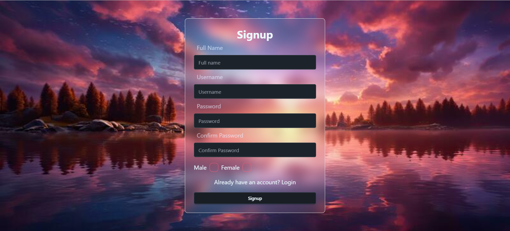
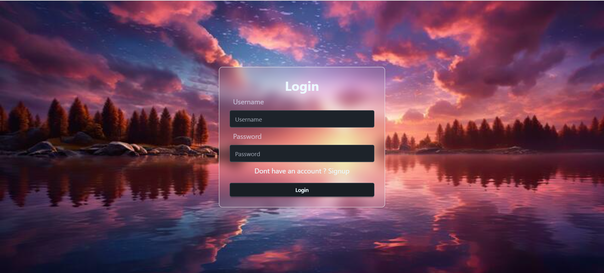
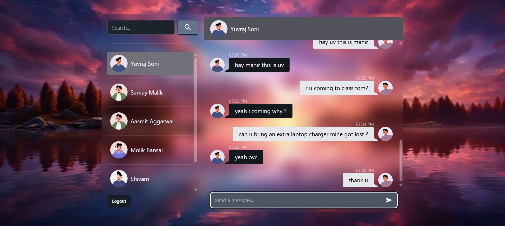

# Chat Application

A real-time chat app with authentication, built using the MERN stack, JWT, and Socket.IO.

---

## 📖 About
This project is a **real-time chat application** that enables users to securely log in, join conversations, and exchange messages instantly.  
It demonstrates how to combine **authentication**, **real-time communication**, and a **scalable backend** into a modern fullstack project.

---

## 🚀 Features
- 🔐 User signup/login with **JWT authentication**  
- ⚡ **Real-time messaging** using **Socket.IO**  
- 👥 One-to-one and group chat support  
- 🗄️ Persistent chat history with MongoDB  
- 📱 Responsive UI for a smooth experience  

---

## 🛠️ Tech Stack

- [MongoDB](https://www.mongodb.com/) – NoSQL database for storing users, chats, and messages  
- [Express.js](https://expressjs.com/) – Backend framework for building APIs  
- [React](https://react.dev/) – Frontend library for building the user interface  
- [Node.js](https://nodejs.org/) – JavaScript runtime for the backend  
- [Socket.IO](https://socket.io/) – Real-time communication for messaging  
- [JWT (JSON Web Token)](https://jwt.io/) – Secure authentication  

## 📸 Screenshots

Here are some snapshots of the application:

### 🔐 Signup

### 🔑 Login

### 👥 One-to-One Chat

## 👨‍💻 Author
- Yuvraj Soni  
- [LinkedIn](https://www.linkedin.com/in/yuvraj-soni-73ab60253/) | [GitHub](https://github.com/YUVRAJsoni999)
